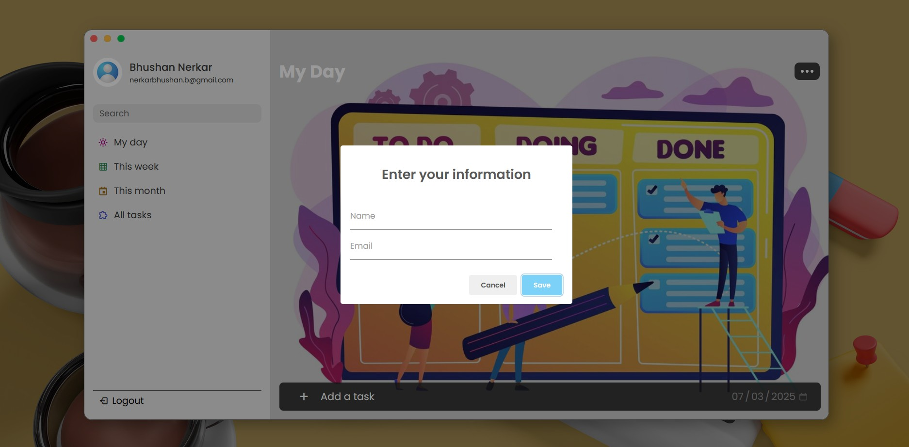
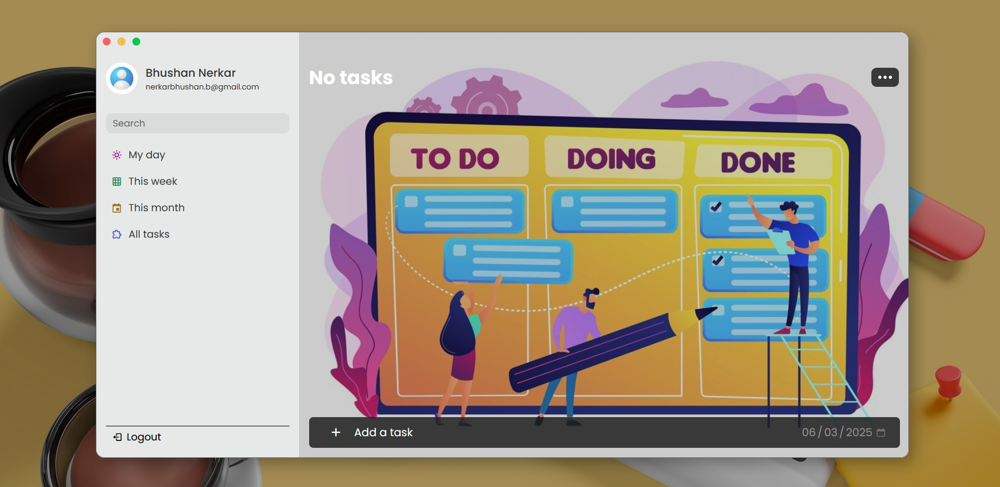
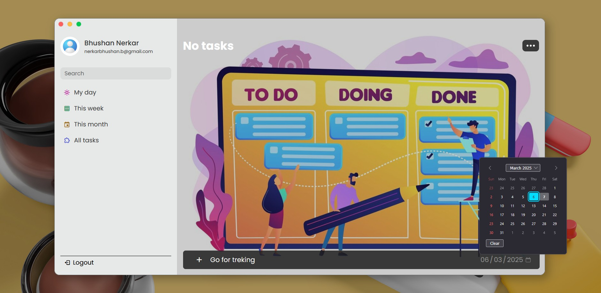
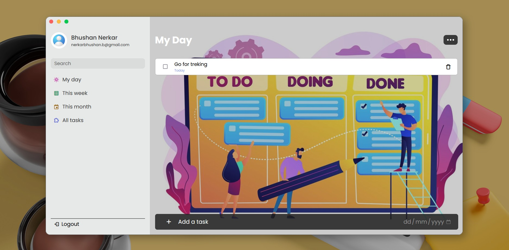
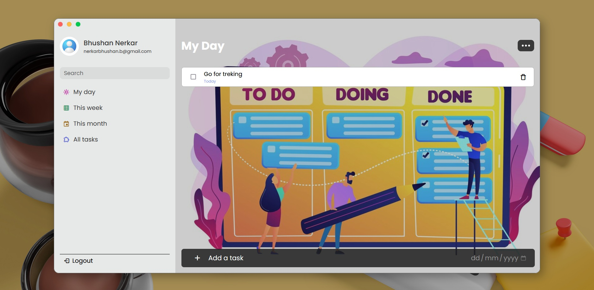
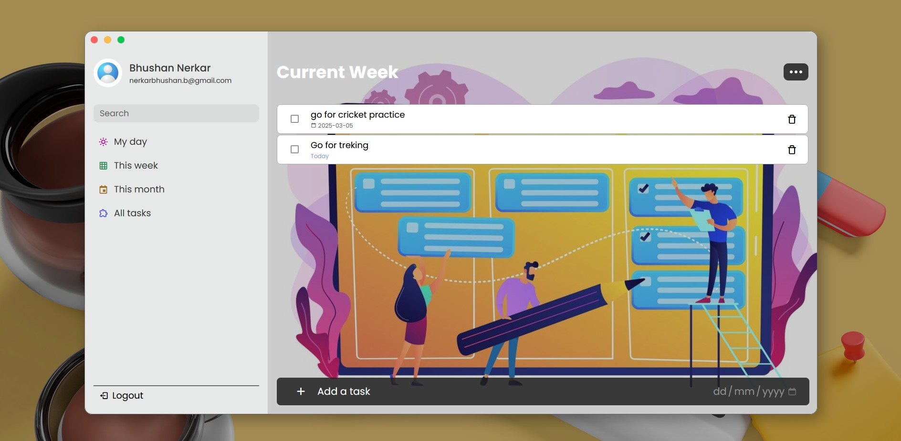
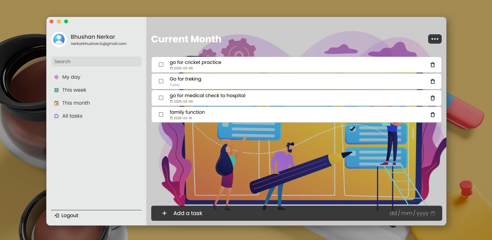
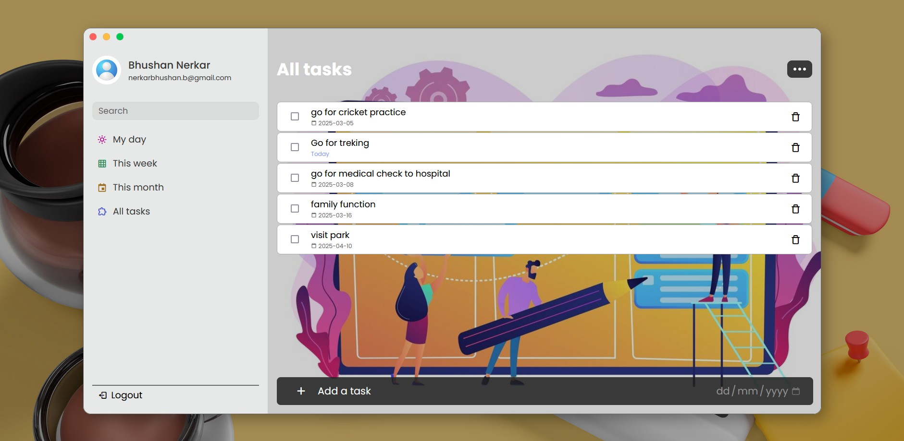

# To-Do List App 📝

## Overview 🌟

The To-Do List app is a simple and efficient task management tool that helps you stay organized and productive. With its user-friendly interface, you can easily add, update, and delete tasks to keep track of your daily, weekly, and monthly tasks. This README file provides detailed information on how to use the app effectively and highlights its key features.

## Features 🚀

- ✅ Add tasks with descriptions and due dates.
- 📅 Organize tasks into four sections: "My Day," "Current Week," "Current Month," and "All Tasks."
- ✔️ Mark tasks as completed or pending with checkboxes.
- 🗑️ Delete tasks with a simple click on the trash icon.
- 📋 Fetch and display user profile data from the "data.txt" file.
- 🔢 Sort tasks based on due dates in ascending order.

## Screenshots 📸

_Screenshot of the To-Do List app showing registration process with name and email._

_Screenshot of the To-Do List app showing tasks empty homepage since no tasks added yet._

_Screenshot of the To-Do List app showing tasks with description and date selecting from calender._

_Screenshot of the To-Do List app showing a task has been created for My day(Today)._

_Screenshot of the To-Do List app showing tasks for today using the My day from side bar._

_Screenshot of the To-Do List app showing tasks for current week using the This week from side bar._

_Screenshot of the To-Do List app showing tasks for current month using the This month from side bar._

_Screenshot of the To-Do List app showing ALL tasks using the All tasks from side bar._

_Screenshot of the To-Do List app showing completed tasks marked as completed by check-box._

_Screenshot of the To-Do List app showing deleting the task if needed to delete_

_Screenshot of the To-Do List app on Mobile device._

## How to Use 📖

1. **Adding a Task:** To add a new task, enter the task description and due date in the input fields provided. Press the "Add" button or press Enter to save the task to the list.

2. **Sections:** The app offers four sections: "My Day," "Current Week," "Current Month," and "All Tasks." Click on the respective section links to view tasks that match the criteria.

3. **Checkbox:** Each task has a checkbox beside it. Check the box to mark a task as completed. Uncheck it to mark it as pending.

4. **Delete Task:** To delete a task, click on the trash icon beside the task. A confirmation popup will appear to confirm the deletion.

5. **Search Function**: You can search for specific tasks by typing keywords in the search box and pressing Enter. The app will filter and display tasks that match the search query and the section currently selected.

6. **Updating Profile:** Once you load the page, you will be prompted to create the profile using name and email. This will be stored in local storage.

## Important Notes ⚠️

- Please ensure to fill both the task description and due date fields before adding a new task.
- Tasks are sorted based on due dates in ascending order.
- This app is completely responsive.
- For the app to work properly, you need to host it on a localhost or a server. Simply opening the index file as a web page won't provide the required functionality.

## Try it Online 💻

You can try the To Do List application online by following [this link](https://nerkarbhushan-to-do-app.netlify.app/).

## Feedback and Support 💌

Thank you for using my To-Do List app. I hope it helps you stay organized and productive. If you have any feedback, or suggestions, or encounter any issues, please feel free to contact the developer, Bhushan B Nerkar, at nerkarbhushan.b@gmail.com

Happy tasking! 😊
